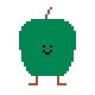
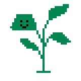
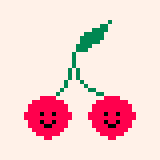

# LD52

## Veggies

| Veggie                            | Constraints                                                                                                   |
|-----------------------------------|---------------------------------------------------------------------------------------------------------------|
|  | - **invasive:** Loves being next to other strawberries                                                        |
|      | - **pure:** Hates being next to a rock                                                                        |
|      | - **dry:** Hates being next to water                                                                          |
|       | - **foliage:** Its leaves bother adjacent veggies                                                             |
|        | - **tangled:** Its roots bother adjacent carrots and garlic                                                   |
|      | - **protected:** Loves being next to garlic or carrots                                                        |
|      | - **pairs:** Loves being next to exactly one cherry<br/>- **alone:** Hates apple trees in its line and column |

## Build, Run

### Run locally

```bash
cargo run
```

### Build for the web

```bash
trunk build --release
```

At this point the build can be tested with:

```bash
basic-http-server dist
```

**Important:** To make the `dist/` folder compatible with itch.io, make sure all links in `dist/index.html` are prefixed with `./`.