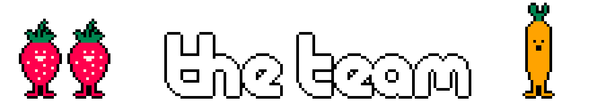
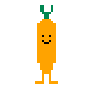
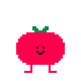
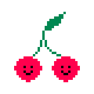

<p align="center">
    
</p>

[](https://ldjam.com/events/ludum-dare/52/mad-veggies) [](https://github.com/bevyengine/bevy) [](https://yopox.itch.io/mad-veggies)

<p align="center">
    
</p>

> It's winter, time to plan our future garden to get the best harvest possible!
>
> *mad veggies* is a puzzle game about interactions between vegetables. Some interactions are inspired from irl gardening, and some are made up to add some challenge ;)

<p align="center">
    
</p>

- **Title screen**: Click on a button
- **Level selection**: Click on `?` for tutorials and `o` for levels.
- **Puzzle**: Drag the veggies in the grid and find a solution to make them all happy!
- **Level editor**: Type your name, create a level and click on *save level*. It is possible to load any level to see its solution.

<p align="center">
    
</p>

- [yopox](https://mstdn.social/@yopox): code (CLion 2022.3, Rust, Bevy), graphics (Aseprite), levels
- [jmen_balec](https://soundcloud.com/jmen_balec): music, sounds effects (Ableton Live)
- **you?**: custom levels

<p align="center">
    
</p>

<p align="center">
    
</p>

Triple click on a code to select it:

- @yopox:
    - ```VCVWVx8F)Z{cqScI+WB```
- vicortie:
    - ```<SmsWaDt}X#+AMVEkGMbyW9Z!!CKGBSG$YlB?Hn+i*C:.AbA|;EA^DK7qB`D#(P/iCVAB```
- @icalm:
    - ```mGrRHbGH2B#FWO7L2Z.AdE:CkAlxE"B```
- @maxededo:
    - ```OuTA{tMo3ZQY,($L1HK",B/IAD:AnzC```
- @sdelay:
    - ```:d@QoDhz$A8B!mUEU```
- @wouter52:
    - ```Ah@F8CIuuW/B+>TDnDDzU```

## changelog

### 10/01/23

- data: Surround level codes with &grave;&grave;&grave; to avoid complications with **"** and **&grave;** when sharing codes here, replace bad `“` with `"` on loading

### 09/01/23

- audio: make existing music and sounds effect play, don't repeat the music when two screens have the same BGM
- tutorial: fix typos
- misc: fix game states `push`/`pop`
- puzzle: fix displayed level number
- levels: remove duplicated level

## veggies

| Veggie                            | Constraints                                                                                                   |
|-----------------------------------|---------------------------------------------------------------------------------------------------------------|
|  | - **invasive:** Loves being next to other strawberries                                                        |
|      | - **pure:** Hates being next to a rock                                                                        |
|      | - **dry:** Hates being next to water                                                                          |
|       | - **foliage:** Its leaves bother adjacent veggies                                                             |
|        | - **tangled:** Its roots bother adjacent carrots and garlic                                                   |
|      | - **protected:** Loves being next to garlic or carrots                                                        |
|      | - **pairs:** Loves being next to exactly one cherry<br/>- **alone:** Hates apple trees in its line and column |

## Build, Run

`mrmotext` tileset is required as well as the crate `bevy_text_mode`.

### Run locally

```bash
cargo run
```

### Build for the web

```bash
trunk build --release
```

At this point the build can be tested with:

```bash
basic-http-server dist
```

**Important:** To make the `dist/` folder compatible with itch.io, make sure all links in `dist/index.html` are prefixed with `./`.